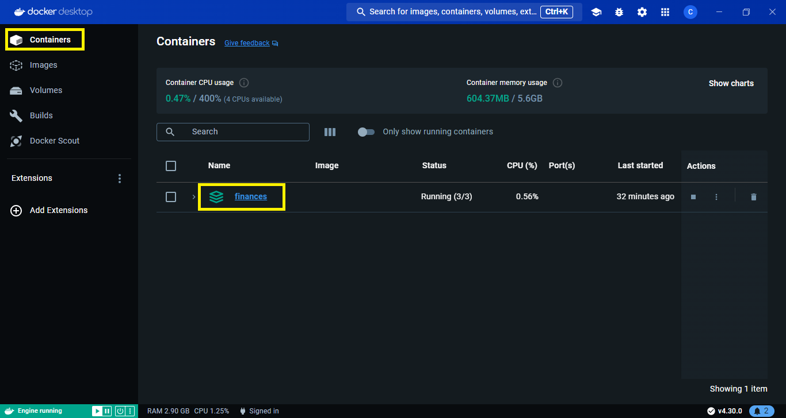

# Requisitos

1. WSL (solo para windows). [Ver guía de instalación](https://learn.microsoft.com/en-us/windows/wsl/install)
2. Docker. [Ver guía de instalación](https://docs.docker.com/engine/install/)

# Instalación

Navega a la ruta donde deseas instalar el programa. Alli se creará un volumen para la persistencia de la base de datos interna de MySQL.

1. Clonación del repositorio.

   ```bash
   git clone https://github.com/santiago-rincon/personal_finances_manager --depth=1
   ```

2. Ejecución de los contenedores. Aseurate ene l caso de Windows que el demonio de Docker este en ejecución (abrir Docker Desktop).

   ```bash
   cd  personal_finances_manager
   docker compose up -d
   ```

# Ejecución

Una vez desplegados los contenedores podrás acceder a [http://localhost](http://localhost) o [http://127.0.0.1](http://127.0.0.1)

Tras ser ejecutado por primera vez, se podrá gestionar los contenedores a través de Docker Desktop.



O través del comando de docker ejecutado desde la carpeta donde se encuentra el proyecto.

```bash
   docker compose -f docker-compose.yml up -d
```

# Actualización del proyecto

Si el proyecto se actualiza es necesario reconstruir los contenedores. Ejecuta los siguientes comandos **desde la carpeta donde se encuentra el proyecto**.

```bash
   git pull origin main
   docker compose -f docker-compose.yml up -d --build
```

# Agregar un dominio (opcional)

Si deseas agregar un dominio como `finances.local` debes editar el archivo `host` de tu sistema operativo el cual se enuentra en:

- Linux: /etc/host
- Windows: C:\Windows\system32\drivers\etc\host

Agrega la siguiente linea:

```
127.0.0.1   tudominio.local
```

# Contraseña para ingresar

Por defecto el sitio viene protegido por autenticación básica de nginx, las credenciales por defecto son:

- Usuario: guest
- Contraseña: guest
  Si desea deshabilitar la contraseña para ingresar al sitio deberá modificar los siguientes archivos:
- `frontend/Dockerfile`
  Se deberán eliminar o comentar las líneas 19 hasta la 24 con un signo de \#, quedando de la siguiente manera:

```
# ENV USERNAME=guest
# ENV PASSWORD=guest

# RUN apk add openssl
# RUN echo -n "$USERNAME:" >> /etc/nginx/.htpasswd
# RUN openssl passwd -apr1 "$PASSWORD" >> /etc/nginx/.htpasswd
```

- `frontend/nginx/`
  Se deberán eliminar o comentar las líneas 14 y 15 con un signo de \#, quedando de la siguiente manera:

```
# auth_basic "Restricted Content";
# auth_basic_user_file /etc/nginx/.htpasswd;
```
